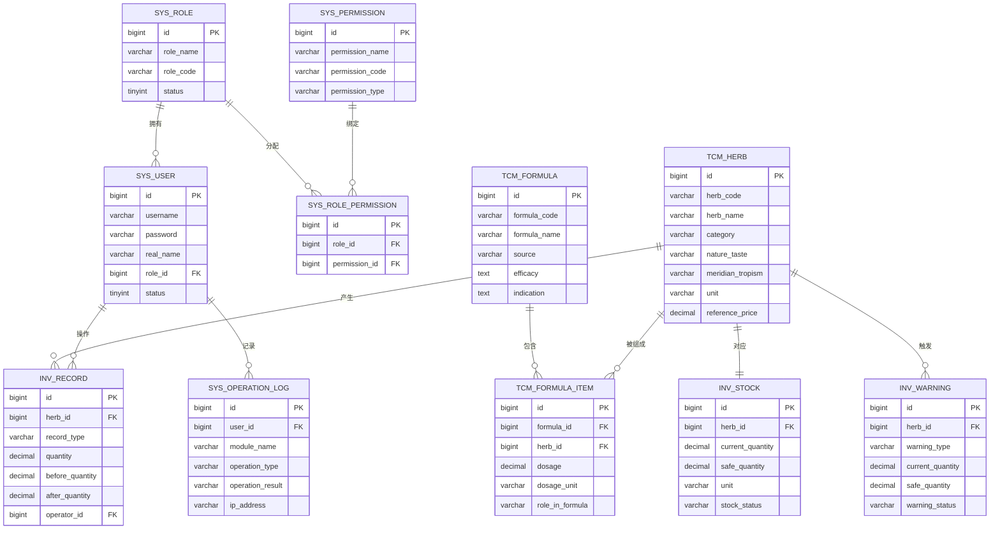
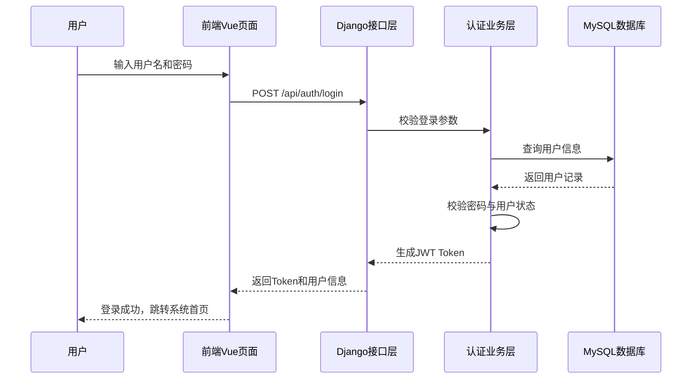
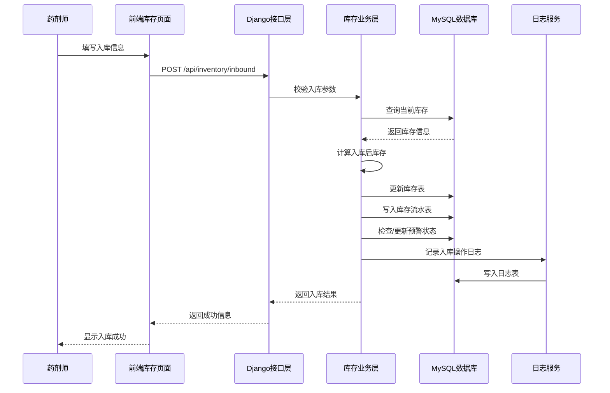
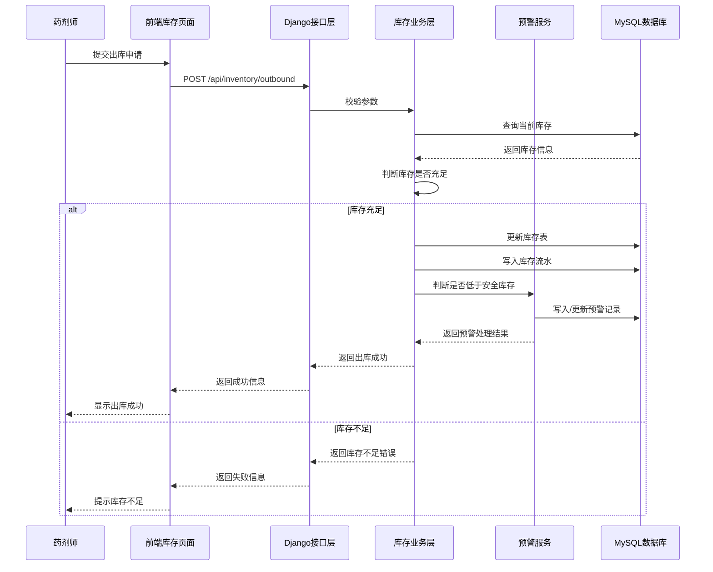
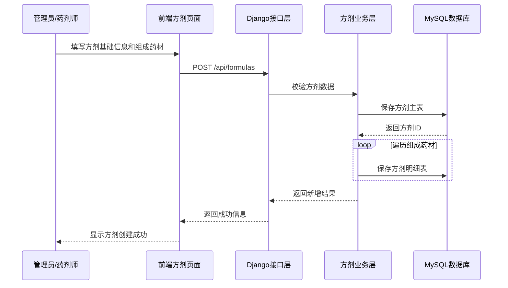

下面给你一份可直接保存为 `.md` 的初稿，内容包括：

1. **数据库表设计**
2. **E-R 图（Mermaid）**
3. **时序图（Mermaid）**

你可以直接放进论文“系统设计”章节，后续我还能继续帮你扩展成 **建表 SQL** 或 **论文中的正式小节版**。

# 基于 Django 的中医药管理系统数据库表设计、E-R 图与时序图

## 1. 数据库设计说明

本系统采用 MySQL 作为关系型数据库，结合 Django ORM 完成数据持久化设计。  
数据库设计遵循以下原则：

- 满足系统核心业务需求；
- 保证数据结构规范化，减少冗余；
- 支持用户权限管理、中药材管理、方剂管理、库存管理等核心模块；
- 支持日志审计和后续功能扩展；
- 便于与 Django 模型映射。

---

## 2. 数据库表设计

## 2.1 用户表（sys_user）

用于保存系统登录用户信息。

| 字段名          | 类型     | 长度 | 主键 | 非空 | 默认值            | 说明             |
| --------------- | -------- | ---: | ---- | ---- | ----------------- | ---------------- |
| id              | bigint   |    - | 是   | 是   | 自增              | 用户主键         |
| username        | varchar  |   50 | 否   | 是   | -                 | 登录用户名       |
| password        | varchar  |  255 | 否   | 是   | -                 | 加密密码         |
| real_name       | varchar  |   50 | 否   | 是   | -                 | 真实姓名         |
| gender          | varchar  |   10 | 否   | 否   | NULL              | 性别             |
| phone           | varchar  |   20 | 否   | 否   | NULL              | 联系电话         |
| email           | varchar  |  100 | 否   | 否   | NULL              | 邮箱             |
| role_id         | bigint   |    - | 否   | 是   | -                 | 角色 ID          |
| status          | tinyint  |    - | 否   | 是   | 1                 | 状态，1启用0禁用 |
| last_login_time | datetime |    - | 否   | 否   | NULL              | 最后登录时间     |
| created_at      | datetime |    - | 否   | 是   | CURRENT_TIMESTAMP | 创建时间         |
| updated_at      | datetime |    - | 否   | 是   | CURRENT_TIMESTAMP | 更新时间         |

---

## 2.2 角色表（sys_role）

用于定义系统角色。

| 字段名      | 类型     | 长度 | 主键 | 非空 | 默认值            | 说明     |
| ----------- | -------- | ---: | ---- | ---- | ----------------- | -------- |
| id          | bigint   |    - | 是   | 是   | 自增              | 角色主键 |
| role_name   | varchar  |   50 | 否   | 是   | -                 | 角色名称 |
| role_code   | varchar  |   50 | 否   | 是   | -                 | 角色编码 |
| description | varchar  |  255 | 否   | 否   | NULL              | 角色描述 |
| status      | tinyint  |    - | 否   | 是   | 1                 | 状态     |
| created_at  | datetime |    - | 否   | 是   | CURRENT_TIMESTAMP | 创建时间 |
| updated_at  | datetime |    - | 否   | 是   | CURRENT_TIMESTAMP | 更新时间 |

---

## 2.3 权限表（sys_permission）

用于定义菜单权限、按钮权限和接口权限。

| 字段名          | 类型     | 长度 | 主键 | 非空 | 默认值            | 说明                      |
| --------------- | -------- | ---: | ---- | ---- | ----------------- | ------------------------- |
| id              | bigint   |    - | 是   | 是   | 自增              | 权限主键                  |
| permission_name | varchar  |  100 | 否   | 是   | -                 | 权限名称                  |
| permission_code | varchar  |  100 | 否   | 是   | -                 | 权限标识                  |
| permission_type | varchar  |   20 | 否   | 是   | -                 | 权限类型：menu/button/api |
| path            | varchar  |  255 | 否   | 否   | NULL              | 路由或接口路径            |
| description     | varchar  |  255 | 否   | 否   | NULL              | 描述                      |
| created_at      | datetime |    - | 否   | 是   | CURRENT_TIMESTAMP | 创建时间                  |

---

## 2.4 角色权限关联表（sys_role_permission）

用于建立角色与权限的多对多关系。

| 字段名        | 类型   | 长度 | 主键 | 非空 | 默认值 | 说明    |
| ------------- | ------ | ---: | ---- | ---- | ------ | ------- |
| id            | bigint |    - | 是   | 是   | 自增   | 主键    |
| role_id       | bigint |    - | 否   | 是   | -      | 角色 ID |
| permission_id | bigint |    - | 否   | 是   | -      | 权限 ID |

---

## 2.5 中药材表（tcm_herb）

用于保存中药材基础信息。

| 字段名           | 类型     | 长度 | 主键 | 非空 | 默认值            | 说明     |
| ---------------- | -------- | ---: | ---- | ---- | ----------------- | -------- |
| id               | bigint   |    - | 是   | 是   | 自增              | 药材主键 |
| herb_code        | varchar  |   50 | 否   | 是   | -                 | 药材编号 |
| herb_name        | varchar  |  100 | 否   | 是   | -                 | 药材名称 |
| alias_name       | varchar  |  100 | 否   | 否   | NULL              | 别名     |
| category         | varchar  |   50 | 否   | 是   | -                 | 分类     |
| nature_taste     | varchar  |  100 | 否   | 否   | NULL              | 性味     |
| meridian_tropism | varchar  |  100 | 否   | 否   | NULL              | 归经     |
| efficacy         | text     |    - | 否   | 否   | NULL              | 功效     |
| indication       | text     |    - | 否   | 否   | NULL              | 主治     |
| origin_place     | varchar  |  100 | 否   | 否   | NULL              | 产地     |
| storage_method   | varchar  |  255 | 否   | 否   | NULL              | 储存方式 |
| unit             | varchar  |   20 | 否   | 是   | -                 | 单位     |
| reference_price  | decimal  | 10,2 | 否   | 否   | 0.00              | 参考价格 |
| description      | text     |    - | 否   | 否   | NULL              | 药材描述 |
| status           | tinyint  |    - | 否   | 是   | 1                 | 状态     |
| created_at       | datetime |    - | 否   | 是   | CURRENT_TIMESTAMP | 创建时间 |
| updated_at       | datetime |    - | 否   | 是   | CURRENT_TIMESTAMP | 更新时间 |

---

## 2.6 方剂表（tcm_formula）

用于保存方剂基础信息。

| 字段名           | 类型     | 长度 | 主键 | 非空 | 默认值            | 说明     |
| ---------------- | -------- | ---: | ---- | ---- | ----------------- | -------- |
| id               | bigint   |    - | 是   | 是   | 自增              | 方剂主键 |
| formula_code     | varchar  |   50 | 否   | 是   | -                 | 方剂编号 |
| formula_name     | varchar  |  100 | 否   | 是   | -                 | 方剂名称 |
| source           | varchar  |  100 | 否   | 否   | NULL              | 方剂来源 |
| efficacy         | text     |    - | 否   | 否   | NULL              | 功效     |
| indication       | text     |    - | 否   | 否   | NULL              | 主治     |
| usage_method     | text     |    - | 否   | 否   | NULL              | 用法用量 |
| contraindication | text     |    - | 否   | 否   | NULL              | 禁忌说明 |
| remark           | varchar  |  255 | 否   | 否   | NULL              | 备注     |
| status           | tinyint  |    - | 否   | 是   | 1                 | 状态     |
| created_at       | datetime |    - | 否   | 是   | CURRENT_TIMESTAMP | 创建时间 |
| updated_at       | datetime |    - | 否   | 是   | CURRENT_TIMESTAMP | 更新时间 |

---

## 2.7 方剂组成明细表（tcm_formula_item）

用于建立方剂与中药材之间的多对多关系，并记录剂量信息。

| 字段名          | 类型    | 长度 | 主键 | 非空 | 默认值 | 说明         |
| --------------- | ------- | ---: | ---- | ---- | ------ | ------------ |
| id              | bigint  |    - | 是   | 是   | 自增   | 主键         |
| formula_id      | bigint  |    - | 否   | 是   | -      | 方剂 ID      |
| herb_id         | bigint  |    - | 否   | 是   | -      | 药材 ID      |
| dosage          | decimal | 10,2 | 否   | 是   | 0.00   | 剂量         |
| dosage_unit     | varchar |   20 | 否   | 是   | -      | 剂量单位     |
| role_in_formula | varchar |   20 | 否   | 否   | NULL   | 君臣佐使角色 |
| sort_no         | int     |    - | 否   | 否   | 0      | 排序号       |
| remark          | varchar |  255 | 否   | 否   | NULL   | 备注         |

---

## 2.8 库存表（inv_stock）

用于记录药材当前库存。

| 字段名             | 类型     | 长度 | 主键 | 非空 | 默认值            | 说明         |
| ------------------ | -------- | ---: | ---- | ---- | ----------------- | ------------ |
| id                 | bigint   |    - | 是   | 是   | 自增              | 库存主键     |
| herb_id            | bigint   |    - | 否   | 是   | -                 | 药材 ID      |
| current_quantity   | decimal  | 10,2 | 否   | 是   | 0.00              | 当前库存数量 |
| safe_quantity      | decimal  | 10,2 | 否   | 是   | 0.00              | 安全库存阈值 |
| unit               | varchar  |   20 | 否   | 是   | -                 | 库存单位     |
| warehouse_location | varchar  |  100 | 否   | 否   | NULL              | 存放位置     |
| stock_status       | varchar  |   20 | 否   | 是   | normal            | 库存状态     |
| updated_at         | datetime |    - | 否   | 是   | CURRENT_TIMESTAMP | 更新时间     |

---

## 2.9 库存流水表（inv_record）

用于记录所有库存变更记录。

| 字段名          | 类型     | 长度 | 主键 | 非空 | 默认值            | 说明                         |
| --------------- | -------- | ---: | ---- | ---- | ----------------- | ---------------------------- |
| id              | bigint   |    - | 是   | 是   | 自增              | 流水主键                     |
| herb_id         | bigint   |    - | 否   | 是   | -                 | 药材 ID                      |
| record_type     | varchar  |   20 | 否   | 是   | -                 | 类型：inbound/outbound/check |
| quantity        | decimal  | 10,2 | 否   | 是   | 0.00              | 变更数量                     |
| before_quantity | decimal  | 10,2 | 否   | 是   | 0.00              | 变更前数量                   |
| after_quantity  | decimal  | 10,2 | 否   | 是   | 0.00              | 变更后数量                   |
| operator_id     | bigint   |    - | 否   | 是   | -                 | 操作人 ID                    |
| business_no     | varchar  |   50 | 否   | 否   | NULL              | 业务单号                     |
| remark          | varchar  |  255 | 否   | 否   | NULL              | 备注                         |
| created_at      | datetime |    - | 否   | 是   | CURRENT_TIMESTAMP | 创建时间                     |

---

## 2.10 库存预警表（inv_warning）

用于记录库存不足预警信息。

| 字段名           | 类型     | 长度 | 主键 | 非空 | 默认值            | 说明                  |
| ---------------- | -------- | ---: | ---- | ---- | ----------------- | --------------------- |
| id               | bigint   |    - | 是   | 是   | 自增              | 预警主键              |
| herb_id          | bigint   |    - | 否   | 是   | -                 | 药材 ID               |
| warning_type     | varchar  |   20 | 否   | 是   | shortage          | 预警类型              |
| current_quantity | decimal  | 10,2 | 否   | 是   | 0.00              | 当前库存              |
| safe_quantity    | decimal  | 10,2 | 否   | 是   | 0.00              | 安全库存              |
| warning_status   | varchar  |   20 | 否   | 是   | active            | 状态：active/resolved |
| generated_at     | datetime |    - | 否   | 是   | CURRENT_TIMESTAMP | 生成时间              |
| resolved_at      | datetime |    - | 否   | 否   | NULL              | 解除时间              |

---

## 2.11 操作日志表（sys_operation_log）

用于记录系统关键业务操作日志。

| 字段名           | 类型     | 长度 | 主键 | 非空 | 默认值            | 说明        |
| ---------------- | -------- | ---: | ---- | ---- | ----------------- | ----------- |
| id               | bigint   |    - | 是   | 是   | 自增              | 日志主键    |
| user_id          | bigint   |    - | 否   | 是   | -                 | 操作用户 ID |
| module_name      | varchar  |   50 | 否   | 是   | -                 | 模块名称    |
| operation_type   | varchar  |   50 | 否   | 是   | -                 | 操作类型    |
| request_method   | varchar  |   10 | 否   | 否   | NULL              | 请求方式    |
| request_url      | varchar  |  255 | 否   | 否   | NULL              | 请求地址    |
| request_param    | text     |    - | 否   | 否   | NULL              | 请求参数    |
| operation_result | varchar  |   20 | 否   | 是   | success           | 操作结果    |
| ip_address       | varchar  |   50 | 否   | 否   | NULL              | IP 地址     |
| created_at       | datetime |    - | 否   | 是   | CURRENT_TIMESTAMP | 创建时间    |

---

## 3. 数据库表关系说明

本系统中主要实体关系如下：

1. 一个角色可以对应多个用户；
2. 一个角色可以拥有多个权限，一个权限也可以分配给多个角色；
3. 一个方剂可以包含多味中药材，一味中药材也可以出现在多个方剂中；
4. 一味中药材对应一条库存记录，但可以对应多条库存流水；
5. 一味中药材可以产生多条库存预警记录；
6. 一个用户可以产生多条操作日志和库存流水记录。

---

## 4. E-R 图
下面给出系统核心实体关系图。


------

## 5. 时序图设计

## 5.1 用户登录时序图

用于描述用户登录、后端认证和返回 Token 的过程。



------

## 5.2 药材入库时序图

用于描述库存入库业务流程。



------

## 5.3 药材出库时序图

用于描述药材出库与库存预警触发流程。



------

## 5.4 方剂新增时序图

用于描述新增方剂及保存组成药材信息的过程。



------

## 6. 数据库设计小结

本系统数据库设计围绕“用户权限、药材信息、方剂信息、库存业务、日志审计”五大核心对象展开。
通过建立用户表、角色表、权限表、中药材表、方剂表、库存表、库存流水表、库存预警表和日志表，可以较完整地支撑中医药管理系统的业务运行。
在此基础上，E-R 图清晰描述了实体之间的联系，时序图则进一步说明了系统关键业务流程，为后续 Django 模型设计、接口开发和论文系统设计章节撰写提供了基础依据。

```
你下一步最适合继续做的是把这份内容再往下扩展成 **MySQL 建表 SQL 设计**，这样就能直接衔接论文里的“数据库实现”。
```